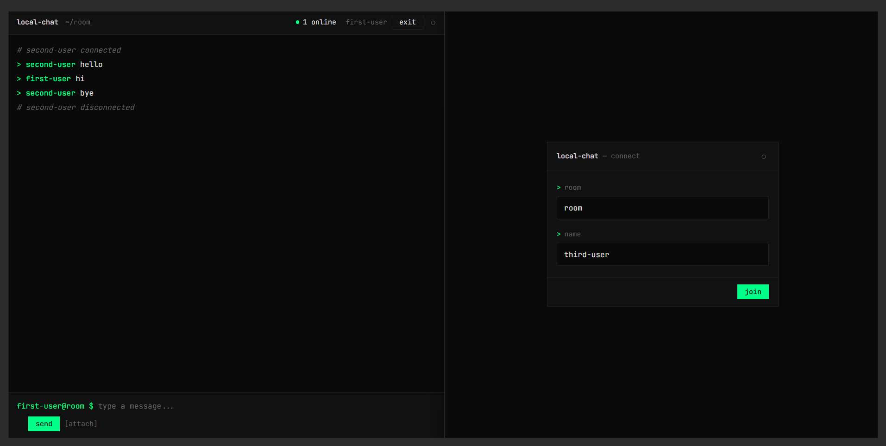

# Local Chat

Simple real-time chat for your local network. Share text, links, and images between your devices instantly — phone to laptop, tablet to desktop, or any device with a browser.



## Why?

Ever needed to quickly send a link from your phone to your computer? Or share a screenshot between devices without uploading to cloud services? Local Chat solves this by providing a lightweight, self-hosted chat that works entirely within your local network.

**Use cases:**
- Share links, code snippets, or notes between your devices
- Transfer images without cloud uploads or cables
- Quick copy-paste across different operating systems
- No accounts, no internet required — just your local network

## Features

- Real-time messaging via SSE
- Multiple chat rooms
- Typing indicators
- File sharing (images)
- Light/dark theme
- Auto-generated usernames based on device
- **End-to-end encryption** (optional)

## Security

Local Chat supports optional end-to-end encryption. When you enter a password while joining a room, all messages and files are encrypted in your browser before being sent. Only devices with the same password can decrypt the content.

- **Encryption**: AES-256-GCM
- **Key derivation**: PBKDF2 with 100,000 iterations
- **How it works**: Password is never sent to server. Messages are encrypted client-side and transmitted as encrypted blobs. Even if someone intercepts the traffic, they can't read the content without the password.

> **Tip**: Share the room name and password with your devices through a secure channel (e.g., type it manually). If you don't need encryption on a trusted local network, simply leave the password field empty.

## Tech Stack

- **Frontend**: React, TypeScript, Valtio
- **Backend**: Bun
- **Protocol**: SSE (Server-Sent Events)
- **Package manager**: PNPM

## Installation

### Using Docker (Recommended)

```yaml
#docker-compose.yaml

version: '3.8'

services:
  local-chat:
    image: dudiq/local-chat:latest
    container_name: local-chat
    ports:
      - "3008:3000"
    restart: unless-stopped
    deploy:
      resources:
        limits:
          cpus: '0.5'
          memory: 256M
    logging:
      driver: json-file
      options:
        max-size: "10m"
        max-file: "3"
```

```bash
docker-compose up -d
```

App will be available at `http://localhost:3008`

### Manual Setup

1. Install dependencies:

```bash
# Client
cd client && pnpm i

# Server (requires Bun)
cd server && pnpm i
```

2. Build frontend:

```bash
cd client && pnpm build
```

3. Run server:

```bash
cd server && pnpm start
```

App will be available at `http://localhost:3000`

## License

MIT
